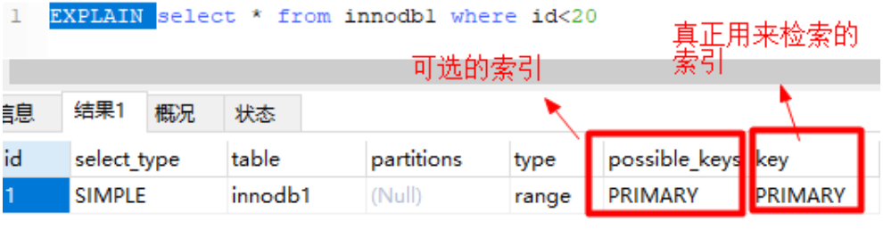
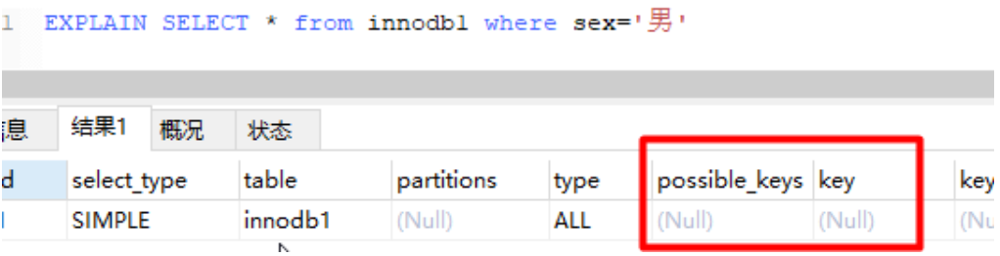
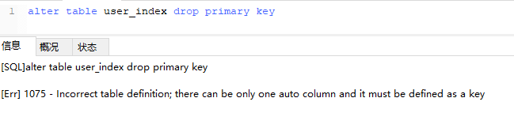

# 数据库索引

### 什么是索引?

* 索引是一种数据结构,可以以一个或者多个字段的值为输入,并能"快速地"找出具有该值的记录.
* 索引是一种特殊的文件\(InnoDB 数据表上的索引是表空间的一个组成部分\),他们所包含着对数据表里所有记录的引用指针
* 索引是一个文件,需要占用物理空间

### 索引的作用是什么?

* 索引使我们自只需查看所有可能记录中的一小部分就能够找到所需记录

### 索引有哪些优点？

#### 优点：

* 可以大大加快数据的检索速度，这也是创建索引的最主要原因
* 通过索引，可以在查询过程中使用优化隐藏器，提高系统的性能

#### 缺点：

* 时间：
  * 创建索引和维护索引需要耗费时间，具体的，对表的数据进行增加、删除、修改的时候，索引需要动态的进行维护，会降低  增、删、改、查的执行效率
* 空间：
  * 索引需要占用物理空间

### 索引的使用场景有哪些？

* **where**



               上图中，根据 id 查询记录，因为id字段仅建立了主键索引，因此此SQL执行可选的索引只有主键索引，如果有多个，最终会选一个较优的作为检索的依据

```text
-- 增加一个没有建立索引的字段
alter table innodb1 add sex char(1);

-- 按sex检索时可选的索引为null
EXPLAIN SELECT * from innodb1 where sex='男';
```




可以尝试在一个字段未建立索引时，根据该字段查询的效率，然后对该字段建立索引（alter table 表名 add index\(字段名\)），同样的SQL执行的效率，这样操作查询效率会有明显的提升（数据量越大越明显）。


* **order by**
  * 当我们使用order by将查询结果按照某个字段排序时，如果该字段没有建立索引，那么执行计划会将查询出的所有数据使用外部排序（将数据从硬盘分批读取到内存使用内部排序，最后合并排序结果），这个操作是很影响性能的，因为需要将查询涉及到的所有数据从磁盘中读到内存（如果单条数据过大或者数据量过多都会降低效率），更无论读到内存之后的排序了。
  * 但是如果我们对该字段建立索引 alter table 表名 add index\(字段名\)，那么由于索引本身是有序的，因此直接按照索引的顺序和映射关系逐条取出数据即可。而且如果分页的，那么只用取出索引表某个范围内的索引对应的数据，而不用像上述那取出所有数据进行排序再返回某个范围内的数据。（从磁盘取数据是最影响性能的）
* **join**


 对`join`语句匹配关系（`on`）涉及的字段建立索引能够提高效率


* 索引覆盖
  * 如果要查询的字段都建立过索引，那么引擎会直接在索引表中查询而不会访问原始数据（否则只要有一个字段没有建立索引就会做全表扫描），这叫索引覆盖。因此我们需要尽可能的在select后只写必要的查询字段，以增加索引覆盖的几率。

    这里值得注意的是不要想着为每个字段建立索引，因为优先使用索引的优势就在于其体积小。

### 索引有哪几种类型?

* **主键索引:**
  * 数据列不允许重复，不允许为NULL，一个表只能有一个主键。
* **唯一索引:**
  * 数据列不允许重复，允许为NULL值，一个表允许多个列创建唯一索引。
    * 可以通过 **`ALTER TABLE table_name ADD UNIQUE (column);`**创建唯一索引
    * 可以通过  **`ALTER TABLE table_name ADD UNIQUE (column1,column2);`** 创建唯一组合索引
* **普通索引:**
  * 基本的索引类型，没有唯一性的限制，允许为NULL值。
    * 可以通过**`ALTER TABLE table_name ADD INDEX index_name (column);`**创建普通索引
    * 可以通过**`ALTER TABLE table_name ADD INDEX index_name(column1, column2, column3);`**创建组合索引
* **全文索引:**
  * 是目前搜索引擎使用的一种关键技术
    * 可以通过**ALTER TABLE table\_name ADD FULLTEXT \(column\);**创建全文索引

### MyISAM索引与InnoDB索引的区别？

* InnoDB索引是聚簇索引，MyISAM索引是非聚簇索引
* InnoDB的主键索引的叶子节点存储着行数据，因此主键索引非常高效
* MyISAM索引的叶子节点存储的是行数据地址，需要再寻址一次才能得到数据 
* InnoDB非主键索引的叶子节点存储的是主键和其他带索引的列数据，因此查询时做到覆盖索引会非常高效

### 索引设计的原则?

1. 适合索引的列是出现在where子句中的列，或者连接子句中指定的列
2. 基数较小的类，索引效果较差，没有必要在此列建立索引
3. 使用短索引，如果对长字符串列进行索引，应该指定一个前缀长度，这样能够节省大量索引空间
4. 不要过度索引。索引需要额外的磁盘空间，并降低写操作的性能。在修改表内容的时候，索引会进行更新甚至重构，索引列越多，这个时间就会越长。所以只保持需要的索引有利于查询即可

### 索引创建的原则是?

1. **最左前缀匹配原则**，组合索引非常重要的原则，**mysql会一直向右匹配直到遇到范围查询\(&gt;、&lt;、between、like\)就停止匹配**，比如a = 1 and b = 2 and c &gt; 3 and d = 4 如果建立\(a,b,c,d\)顺序的索引，d是用不到索引的，如果建立\(a,b,d,c\)的索引则都可以用到，a,b,d的顺序可以任意调整。
2. **较频繁作为查询条件的字段**才去创建索引
3. 更新频繁字段不适合创建索引
4. 若是不能有效区分数据的列不适合做索引列\(如性别，男女未知，最多也就三种，区分度实在太低\)
5. 尽量的扩展索引，不要新建索引。比如表中已经有a的索引，现在要加\(a,b\)的索引，那么只需要修改原来的索引即可。
6. 定义有外键的数据列一定要建立索引
7. 对于那些查询中很少涉及的列，重复值比较多的列不要建立索引
8. 对于**定义为text、image和bit**的数据类型的列**不要建立索引**

### 创建索引的3种方式是什么?如何删除索引?

* 在执行**CREATE TABLE**时创建索引

```text
CREATE TABLE user_index2 (
	id INT auto_increment PRIMARY KEY,
	first_name VARCHAR (16),
	last_name VARCHAR (16),
	id_card VARCHAR (18),
	information text,
	KEY name (first_name, last_name),
	FULLTEXT KEY (information),
	UNIQUE KEY (id_card)
);
```

* 使用**ALTER TABLE**命令去增加索引

```text
ALTER TABLE table_name ADD INDEX index_name (column_list);
```


1 ALTER TABLE用来创建普通索引、UNIQUE索引或PRIMARY KEY索引。其中table\_name是要增加索引的表名，column\_list指出对哪些列进行索引，多列时各列之间用逗号分隔。

2 索引名index\_name可自己命名，缺省时，MySQL将根据第一个索引列赋一个名称。另外，ALTER TABLE允许在单个语句中更改多个表，因此可以在同时创建多个索引。


* 使用**CREATE INDEX**命令创建

```text
CREATE INDEX index_name ON table_name (column_list);
```


CREATE INDEX可对表增加普通索引或UNIQUE索引（但是，**不能创建PRIMARY KEY索引**）


* 删除索引： 根据索引名删除普通索引、唯一索引、全文索引：`alter table 表名 drop KEY 索引名`

```text
alter table user_index drop KEY name;
alter table user_index drop KEY id_card;
alter table user_index drop KEY information;
```

删除主键索引：alter table 表名 drop primary key（因为主键只有一个）。这里值得注意的是，如果主键自增长，那么不能直接执行此操作（自增长依赖于主键索引）




这里直接删除主键发现会报错，需要取消自增长才能删除（**但通常不会删除主键，因为设计主键一定与业务逻辑无关**）


```text
alter table user_index
-- 重新定义字段

MODIFY id int,
drop PRIMARY KEY
```

### 创建索引时需要注意什么？

* **非空字段：**
  * 应该指定列为NOT NULL，除非你想存储NULL。在mysql中，含有空值的列很难进行查询优化，因为它们使得索引、索引的统计信息以及比较运算更加复杂。你应该用0、一个特殊的值或者一个空串代替空值
* **取值离散大的字段：**
  * （变量各个取值之间的差异程度）的列放到联合索引的前面，可以通过count\(\)函数查看字段的差异值，返回值越大说明字段的唯一值越多字段的离散程度高；
* **索引字段越小越好：**
  * 数据库的数据存储以页为单位一页存储的数据越多一次IO操作获取的数据越大效率越高。

### 使用索引查询一定能提高查询的性能吗？为什么

通常，通过索引查询数据比全表扫描要快。但是我们也必须注意到它的代价

* 索引需要空间来存储，也需要定期维护， 每当有记录在表中增减或索引列被修改时，索引本身也会被修改。 这意味着每条记录的INSERT，DELETE，UPDATE将为此多付出4，5 次的磁盘I/O。 因为索引需要额外的存储空间和处理，那些不必要的索引反而会使查询反应时间变慢。使用索引查询不一定能提高查询性能，索引范围查询\(INDEX RANGE SCAN\)适用于两种情况：
  * 基于一个范围的检索，一般查询返回结果集小于表中记录数的30%
  * 基于非唯一性索引的检索

### 百万级别或以上的数据如何删除

**关于索引：**由于索引需要额外的维护成本，因为索引文件是单独存在的文件,所以当我们对数据的增加,修改,删除,都会产生额外的对索引文件的操作,这些操作需要消耗额外的IO,会降低增/改/删的执行效率。所以，在我们删除数据库百万级别数据的时候，查询MySQL官方手册得知删除数据的速度和创建的索引数量是成正比的。

* 所以我们想要删除百万数据的时候可以先删除索引（此时大概耗时三分多钟） 
* 然后删除其中无用数据（此过程需要不到两分钟） 
* 删除完成后重新创建索引\(此时数据较少了\)创建索引也非常快，约十分钟左右。 
* 与之前的直接删除绝对是要快速很多，更别说万一删除中断,一切删除会回滚。那更是坑了。

### 什么是前缀索引？

语法：index\(field\(10\)\)，使用字段值的前10个字符建立索引，默认是使用字段的全部内容建立索引。

前提：前缀的标识度高。比如密码就适合建立前缀索引，因为密码几乎各不相同。

实操的难度：在于前缀截取的长度。

我们可以利用`select count(*)/count(distinct left(password,prefixLen));`，通过从调整prefixLen的值（从1自增）查看不同前缀长度的一个平均匹配度，接近1时就可以了（表示一个密码的前prefixLen个字符几乎能确定唯一一条记录）

### 什么是最左前缀原则？什么是最左匹配原则

* 顾名思义，就是最左优先，在创建多列索引时，要根据业务需求，**where子句中使用最频繁的一列放在最左边。**
* **最左前缀匹配原则，非常重要的原则**，mysql会一直向右匹配直到遇到范围查询\(&gt;、&lt;、between、like\)就停止匹配，比如a = 1 and b = 2 and c &gt; 3 and d = 4 如果建立\(a,b,c,d\)顺序的索引，d是用不到索引的，如果建立\(a,b,d,c\)的索引则都可以用到，a,b,d的顺序可以任意调整。
* = 和 in 可以乱序，比如a = 1 and b = 2 and c = 3 建立\(a,b,c\)索引可以任意顺序，mysql的查询优化器会帮你优化成索引可以识别的形式

### 索引的数据结构有哪些?

* 二叉搜索树
* B-树
* B+树
  * BTree是最常用的mysql数据库索引算法，也是mysql默认的算法。因为它不仅可以被用在=,&gt;,&gt;=,&lt;,&lt;=和between这些比较操作符上，而且还可以用于like操作符，只要它的查询条件是一个不以通配符开头的常量

```text
-- 只要它的查询条件是一个不以通配符开头的常量
select * from user where name like 'jack%'; 

-- 如果一通配符开头，或者没有使用常量，则不会使用索引，例如： 
select * from user where name like '%jack';
```

* 散列表
  * Hash索引只能用于对等比较，例如=,&lt;=&gt;（相当于=）操作符。由于是一次定位数据，不像BTree索引需要从根节点到枝节点，最后才能访问到页节点这样多次IO访问，所以检索效率远高于BTree索引。
* 多维数据的树结构\(kd 树 四叉树  R-树\)


一般面试基本问前三个比较多,后面的高级数据结构问的比较少


### **二叉搜索树、B-树、 B+树的区别？**

* 在B树中，将键和值放在内部的节点和叶子节点上，但是在B+树上，内部节点都是键，没有值，叶子节点同时存放键和值

\*\*\*\*

\*\*\*\*

\*\*\*\*

\*\*\*\*

**参考:** 

1. \*\*\*\*[**https://blog.csdn.net/ThinkWon/article/details/104778621**](https://blog.csdn.net/ThinkWon/article/details/104778621)\*\*\*\*
2. \*\*\*\*[**https://juejin.im/post/6844903569632526343**](https://juejin.im/post/6844903569632526343)\*\*\*\*
3. \*\*\*\*[**https://github.com/CyC2018/CS-Notes/blob/master/notes/%E6%95%B0%E6%8D%AE%E5%BA%93%E7%B3%BB%E7%BB%9F%E5%8E%9F%E7%90%86.md\#%E4%B8%8D%E5%8F%AF%E9%87%8D%E5%A4%8D%E8%AF%BB**](https://github.com/CyC2018/CS-Notes/blob/master/notes/%E6%95%B0%E6%8D%AE%E5%BA%93%E7%B3%BB%E7%BB%9F%E5%8E%9F%E7%90%86.md#%E4%B8%8D%E5%8F%AF%E9%87%8D%E5%A4%8D%E8%AF%BB)\*\*\*\*
4. \*\*\*\*[**https://github.com/wolverinn/Waking-Up/blob/master/Database.md**](https://github.com/wolverinn/Waking-Up/blob/master/Database.md)\*\*\*\*
5. \*\*\*\*[**https://blog.csdn.net/weixin\_43336281/article/details/105761758**](https://blog.csdn.net/weixin_43336281/article/details/105761758)\*\*\*\*


