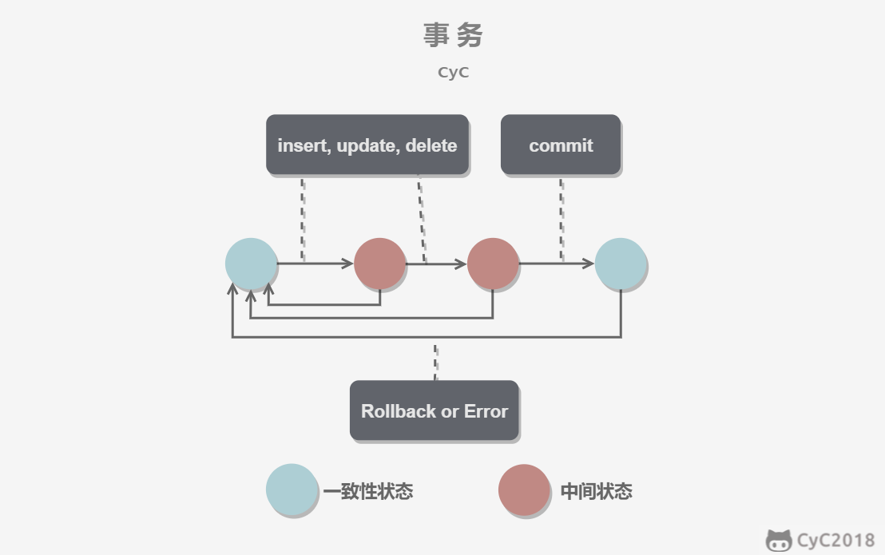
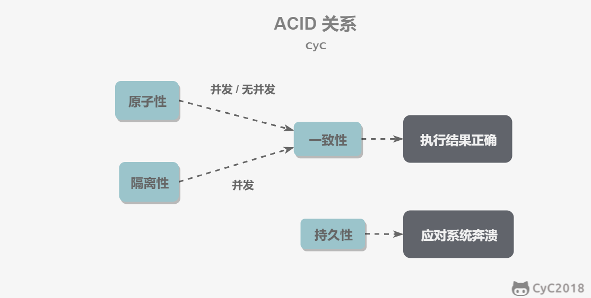
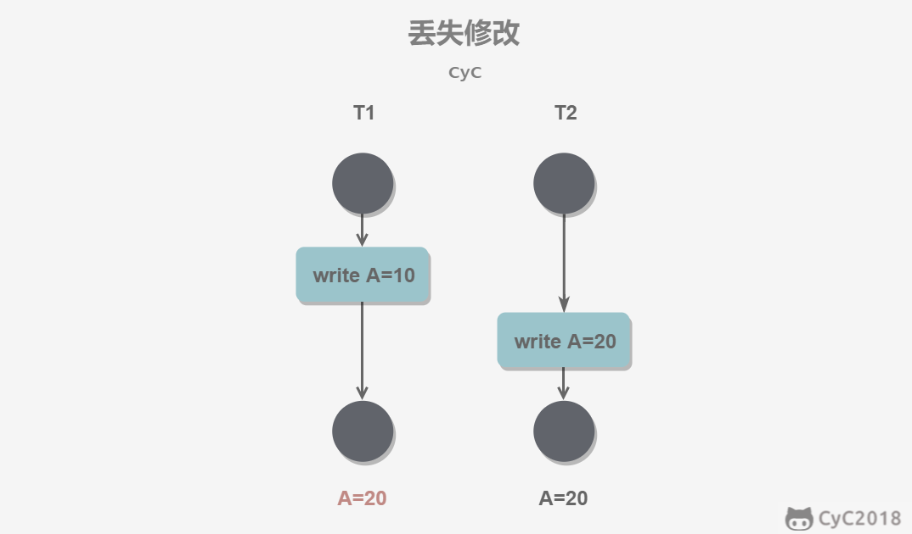
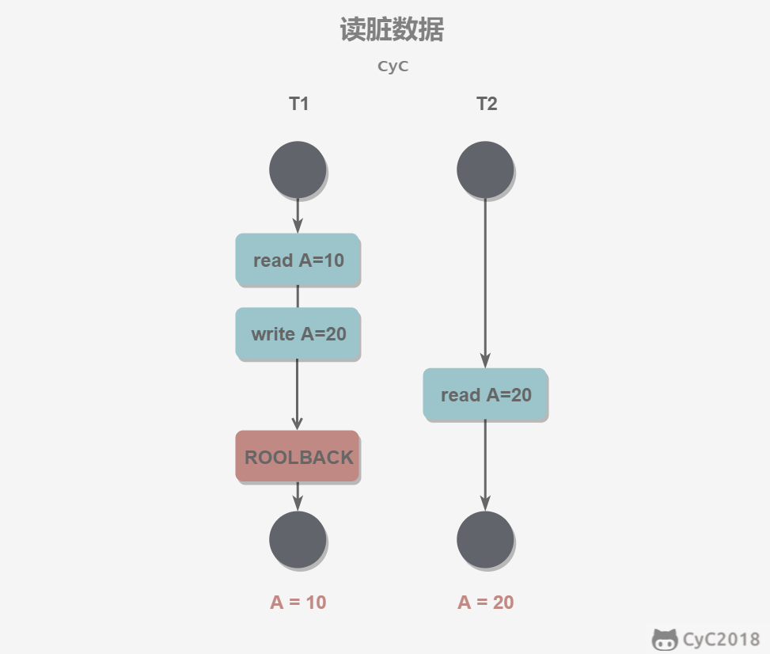
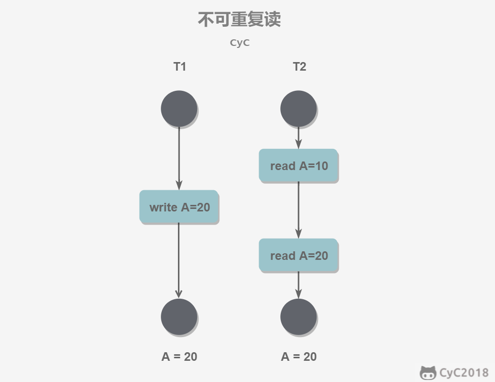
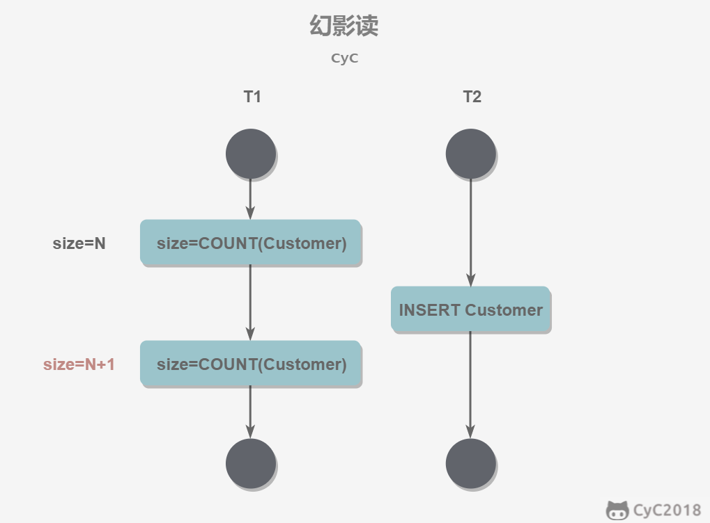
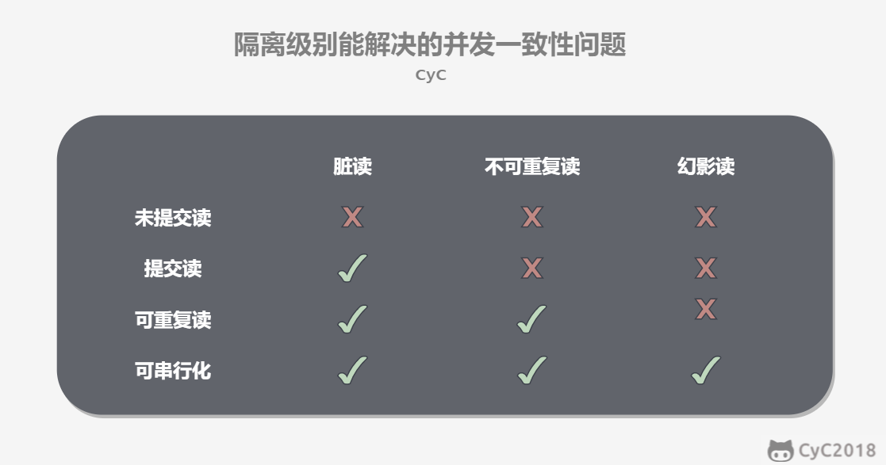

# 数据库原理

## 数据库是计算机用来存放数据的载体

### 为什么不用文件来保存数据？

1. 保存数据是可以的，但是进行查询十分麻烦
2. 使用类似Excel**不支持**关联信息的查询

### 什么是DBMS？

DBMS 是指：为用户提供信息服务的系统，它实现的是   有组织、动态存储大量的相关数据的功能，提供了数据处理和信息资源共享的便利手段

### 什么是关系型数据库？

1. 关系型数据库系统（RDBMS）是指使用了关系模型的数据库系统
2. 关系数据库中，数据是分类存放的，数据之间可以有联系

### 主流的关系数据库有哪些？

* DB2
* Oracle
* Mysql
* SQL Server

### 什么是非关系型数据库\(NOSQL\)/和关系数据库有什么区别？

* NoSQL 数据库是指数据分类存放，但是数据之间没有关联的关系的数据库系统
* 有效存储低价值信息（例如朋友圈这种）
* 关系型数据库需要创建表，各个字段的校验等十分费时
* 关系型数据库大部分是多线程的，NOSQl数据库是单线程的，很好的支持秒杀系统，所以秒杀系统大部分不使用关系型数据库

### 有哪些NoSQL 数据库？

* **Redis**\(存入内存\)
* **Memcache**（使用内存）
* **MOngoDB**（保存在硬盘上的，例如朋友圈，网站通知， 新闻，留言等海量信息）
* **Neo4J** （复杂的组织关系和人际关系）


基本上问到数据库引擎问题，大概率是接下来 **事务、 索引、B+树** 三连


### 什么是数据库存储引擎？

数据库存储引擎是数据库底层软件组织，数据库管理系统（DBMS）使用数据引擎进行创建、查询、更新和删除数据。**不同的存储引擎提供不同的存储机制、索引技巧、锁定水平等功能**，使用不同的存储引擎，还可以获得特定的功能

### 数据库的引擎有哪些？有什么区别？

#### MyIASM

1. MyIASM是Mysql的默认储存引擎，不支持数据库事务、行级锁和外键，因此在 **INSERT** 或者 **UPDATE**数据，即写操作时需要锁定整个表，效率比较低
2. MyIASM的优点是执行读取的速度快，并且占用内存和存储资源较少。（其设计之初就假设数据被组织成固定的长度的记录，且是按照顺序存储的。）
3. 在查找数据时，MyIASM 的缺点是更新数据慢，且不支持事务处理，优点是查询速度快

#### InnoDB

1. InnoDB为MySQL提供了**事务**（Transaction）支持、**回滚**（Rollback）、**崩溃修复**能力（Crash Recovery Capabilities）、**多版本并发控制 MVCC**（Multi-versioned Concurrency Control）、**事务安全**（Transaction-safe）的操作
2. InnoDB的底层 存储结构为**B+树**，B+树的每个节点都对应InnoDB的一个Page，Page大小是固定的，一般被设为16KB。其中，非叶子节点只有键值（索引），**叶子节点**包含完整的**数据**
3. InnoDB 特点（需求场景）有：
   1. 经常有数据更新的表，适合处理多重并发更新请求
   2. 支持事务
   3. 支持灾难恢复
   4. 支持外键约束，只有InnoDB支持外键
   5. 支持增加列属性 auto\_increment
4. InnoDB 适合对标修改要求较高的场景、查询要求比较高的表选择 MyISAM 存储。（如果该数据库需要一个用于查询的临时表，甚至可以考虑选择 MEMORY 存储引擎）


MyISAM 和 InnoDB问的比较多，Memory和TokuDB问的比较少


#### Memory

1. Memory表使用内存空间创建。每个Memory表实际上都对应一个磁盘文件 用于持久化。
2. Memory表因为数据是存放在内存中的，因此访问速度非常快， 通常使用Hash索引来实现数据索引
3. Memory表的缺点是一旦服务关闭，表中 的数据就会丢失
4. Memory还支持散列索引和B树索引。B树索引可以使用部分查询和通配查询，也可以使用不等于和大于等于等操作符方便批量数据访问，散列索引相 对于B树索引来说，基于Key的查询效率特别高，但是基于范围的查询效率不是很高。

#### \*TokuDB

1. TokuDB的底层存储结构为Fractal Tree。Fractal Tree的结构与B+树有些类似，只是在Fractal Tree中除了每一个指针（key），都需要指向一个child（孩 子）节点，child节点带一个Message Buffer，这个Message Buffer是一个先进先 出队列，用来缓存更新操作，具体的数据结构如图所示。
2. 这样，每一次插 入操作都只需落在某节点的Message Buffer上，就可以马上返回，并不需要搜 索到叶子节点。
3. 这些缓存的更新操作会在后台异步合并并更新到对应的节点上。

> 接下来按照 **事务 、并发一致性问题、索引、索引数据结构**的顺序

### 什么是数据库事务？数据库事务有哪些特性？

#### 概念

1. 事务（Transaction）指的是满足 ACID 特性的一组操作，可以通过 Commit 提交一个事务，也可以使用 Rollback 进行回滚。
2. 事务（Transaction）是一个操作序列，不可分割的工作单位，以BEGIN TRANSACTION开始，以ROLLBACK/COMMIT结束

> 来自于大神[CYC](https://github.com/CyC2018/CS-Notes/blob/master/notes/%E6%95%B0%E6%8D%AE%E5%BA%93%E7%B3%BB%E7%BB%9F%E5%8E%9F%E7%90%86.md)的数据库技术知识整理

#### 特性（ACID）

* **原子性（Atom）：**
  * 事务被视为不可分割的最小单元，事务的所有操作要么全部提交成功，要么全部失败回滚。
  * 回滚可以用回滚日志（Undo Log）来实现，回滚日志记录着事务所执行的修改操作，在回滚时反向执行这些修改操作即可。
* **一致性（Consistency）：**
  * 数据库在事务执行前后都保持一致性状态。
  * 在一致性状态下，所有事务对同一个数据的读取结果都是相同的。
* **隔离性（Isolation）：**
  * 一个事务所做的修改在最终提交以前，对其它事务是不可见的。
  * 隔离性是保证事务并发的条件之一
* **持久性（Durability）：**
  * 一旦事务提交，则其所做的修改将会永远保存到数据库中。
  * 即使系统发生崩溃，事务执行的结果也不能丢失。


有时候面试回答到系统崩溃，有可能会问你如何处理系统崩溃问题

### 如何处理系统崩溃问题？

* 系统发生崩溃可以用重做日志（Redo Log）进行恢复，从而实现持久性。
* 与回滚日志记录数据的逻辑修改不同，重做日志记录的是数据页的物理修改。



事务的ACID概念字面意思很简单，但是不是很好理解

### 如何理解事务的ACID？（或者说是ACID的意义是什么？）

\(这里参考了大神[cyc](https://github.com/CyC2018/CS-Notes/blob/master/notes/%E6%95%B0%E6%8D%AE%E5%BA%93%E7%B3%BB%E7%BB%9F%E5%8E%9F%E7%90%86.md)的整理\)

* 只有满足一致性，事务的执行结果才是正确的。
* 在无并发的情况下，事务串行执行，隔离性一定能够满足。此时只要能满足原子性，就一定能满足一致性。
* 在并发的情况下，多个事务并行执行，事务不仅要满足原子性，还需要满足隔离性，才能满足一致性。
* 事务满足持久化是为了能应对系统崩溃的情况。


> ACID关系如下图所示


### 关于 AUTOCOMMIT ：

* MySQL 默认采用自动提交模式。也就是说，如果不显式使用START TRANSACTION语句来开始一个事务，那么每个查询操作都会被当做一个事务并自动提交。


### 为什么会发生并发一致性问题？

在并发环境下，事务的隔离性很难保证，因此会出现很多并发一致性问题。

### （事务的执行）会发生哪些并发一致性问题？

* **丢失修改：**
  * **丢失修改指一个事务的更新操作被另外一个事务的更新操作替换**
    * **eg.** T1 和 T2 两个事务都对一个数据进行修改，T1 先修改并提交生效，T2 随后修改，T2 的修改覆盖了 T1 的修改

* **脏读：**
  * **读脏数据指在不同的事务下，当前事务可以读到另外事务未提交的数据。**
    * **eg.** T1 修改一个数据但未提交，T2 随后读取这个数据。如果 T1 撤销了这次修改，那么 T2 读取的数据是脏数据。

* **不可重复度：**
  * 指在一个事务内多次读取同一数据集合。
  * 在这一事务还未结束前，另一事务也访问了该同一数据集合并做了修改，由于第二个事务的修改，第一次事务的两次读取的数据可能不一致。
    * **eg.** T2 读取一个数据，T1 对该数据做了修改。如果 T2 再次读取这个数据，此时读取的结果和第一次读取的结果不同。

* **幻读：**
  * 幻读本质上也属于不可重复读的情况
  * 当同一查询多次执行时，由于其它事务在这个数据范围内执行了**插入**操作，会导致每次返回不同的结果集
    * **eg.** T1 读取某个范围的数据，T2 在这个范围内插入新的数据，T1 再次读取这个范围的数据，此时读取的结果和和第一次读取的结果不同。


### 产生并发不一致问题的主要原因是?

* 破坏了事务的隔离性，解决方法是**通过并发控制来保证隔离性**
* 并发控制可以通过**封锁**来实现，但是封锁操作需要用户自己控制，相当复杂。
* 数据库管理系统提供了事务的**隔离级别**，让用户以一种更轻松的方式处理并发一致性问题。


> 接下来先介绍事务的隔离级别,再介绍封锁

### 数据库的事务隔离级别有哪些?

* **未提交读\(READ UNCOMMITTED\):**
  * 事务中的修改，即使没有提交，对其它事务也是可见的
  * 在一个事务提交之前，它的执行结果对其它事务也是可见的
* **已提交读\(READ CONMMITTED\): 可解决** **脏读 问题**
  * 一个事务只能读取已经提交的事务所做的修改。换句话说，一个事务所做的修改在提交之前对其它事务是不可见的。
* **可重复读\(REPEATABLE READ \):  可解决  脏读 + 不可重复读 问题**
  * 保证在同一个事务中多次读取同一数据的结果是一样的（MySQL的默认隔离级别）
* **串行化\(SERIALIZABLE\):  可解决  脏读 + 不可重复读 + 幻读 问题**
  * 强制事务串行执行，这样多个事务互不干扰，不会出现并发一致性问题。
  * 该隔离级别需要加锁实现，因为要使用加锁机制保证同一时间只有一个事务执行，也就是保证事务串行执行。
  * 可能导致大量的超时现象和锁竞争，实际很少使用。

