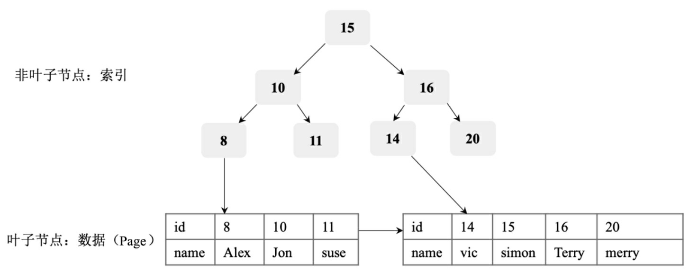

# 数据库引擎

### 什么是数据库存储引擎？

数据库存储引擎是数据库底层软件组织，数据库管理系统（DBMS）使用数据引擎进行创建、查询、更新和删除数据。**不同的存储引擎提供不同的存储机制、索引技巧、锁定水平等功能**，使用不同的存储引擎，还可以获得特定的功能

### 数据库的引擎有哪些？有什么区别？

#### MyIASM

1. MyIASM是Mysql的默认储存引擎，不支持数据库事务、行级锁和外键，因此在 **INSERT** 或者 **UPDATE**数据，即写操作时需要锁定整个表，效率比较低
2. MyIASM的优点是执行读取的速度快，并且占用内存和存储资源较少。（其设计之初就假设数据被组织成固定的长度的记录，且是按照顺序存储的。）
3. 在查找数据时，MyIASM 的缺点是更新数据慢，且不支持事务处理，优点是查询速度快

#### InnoDB

1. InnoDB为MySQL提供了**事务**（Transaction）支持、**回滚**（Rollback）、**崩溃修复**能力（Crash Recovery Capabilities）、**多版本并发控制 MVCC**（Multi-versioned Concurrency Control）、**事务安全**（Transaction-safe）的操作
2. InnoDB的底层 存储结构为**B+树**，B+树的每个节点都对应InnoDB的一个Page，Page大小是固定的，一般被设为16KB。其中，非叶子节点只有键值（索引），**叶子节点**包含完整的**数据**
3. InnoDB 特点（需求场景）有：
   1. 经常有数据更新的表，适合处理多重并发更新请求
   2. 支持事务
   3. 支持灾难恢复
   4. 支持外键约束，只有InnoDB支持外键
   5. 支持增加列属性 auto\_increment
4. InnoDB 适合对标修改要求较高的场景、查询要求比较高的表选择 MyISAM 存储。（如果该数据库需要一个用于查询的临时表，甚至可以考虑选择 MEMORY 存储引擎）


MyISAM 和 InnoDB问的比较多，Memory和TokuDB问的比较少


#### Memory

1. Memory表使用内存空间创建。每个Memory表实际上都对应一个磁盘文件 用于持久化。
2. Memory表因为数据是存放在内存中的，因此访问速度非常快， 通常使用Hash索引来实现数据索引
3. Memory表的缺点是一旦服务关闭，表中 的数据就会丢失
4. Memory还支持散列索引和B树索引。B树索引可以使用部分查询和通配查询，也可以使用不等于和大于等于等操作符方便批量数据访问，散列索引相 对于B树索引来说，基于Key的查询效率特别高，但是基于范围的查询效率不是很高。

#### \*TokuDB

1. TokuDB的底层存储结构为Fractal Tree。Fractal Tree的结构与B+树有些类似，只是在Fractal Tree中除了每一个指针（key），都需要指向一个child（孩 子）节点，child节点带一个Message Buffer，这个Message Buffer是一个先进先 出队列，用来缓存更新操作，具体的数据结构如图所示。
2. 这样，每一次插 入操作都只需落在某节点的Message Buffer上，就可以马上返回，并不需要搜 索到叶子节点。
3. 这些缓存的更新操作会在后台异步合并并更新到对应的节点上。

>

